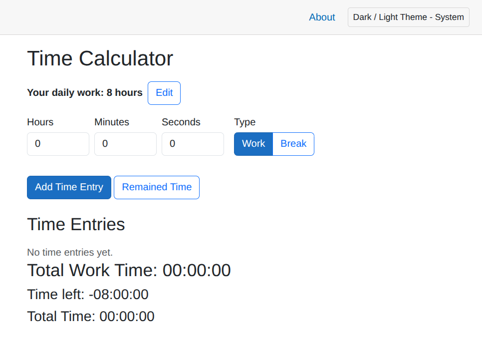

# Time Calculator

[](https://codespaces.new/notNullThen/time-calculator-blazor)

A minimal time tracking application built with **.NET 10** and **Blazor Server**.

**Live Demo:** https://time-calculator-blazor.onrender.com/



> **Note:** The C# logic is implemented manually, while the frontend-related code (HTML, CSS, etc) is vibe-coded.

## Features
- Track daily work hours and tasks
- Light/Dark theme toggle
- Mobile screen support

## Run

### Run with Docker Compose:
```bash
docker compose up --build
```

The application will be available at `http://localhost:8080` by default. The `--build` flag ensures the Docker image is rebuilt with the latest changes from your local codebase.

### Standard run:
```bash
dotnet run --project TimeCalculator
```

### Run with network access (accessible from other devices):
```bash
dotnet run --project TimeCalculator --urls "http://0.0.0.0:8080"
```
